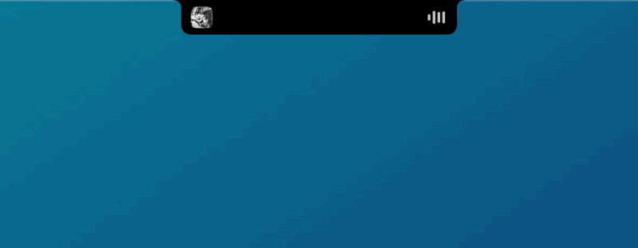

# Kekova Island

Turn the MacBook notch into something you can actually use: music, timers, a file shelf, your next meeting and little live notices, all growing out of the notch the way the Dynamic Island does on iPhone.

<p align="center"></p>

> **Why "Kekova"?** Kekova is a small island off Turkey's Mediterranean coast, known for the ruins of a sunken city just below its turquoise water. A notch island seemed like a good place to borrow the name from.

## Features

| | |
|---|---|
| 🎵 **Now playing** | Artwork, title and controls for whatever is playing (YouTube Music, Spotify, Apple Music, a browser tab...). While music plays, the closed island shows the cover and equalizer bars tinted with the artwork's color. |
| ⏱ **Timer** | Presets or a custom duration, pause, +1 min. The countdown sits next to the notch, and the island opens with a sound when time is up. |
| 📅 **Calendar** | Your next events, with a **Join** button for Zoom, Google Meet, Teams and Webex links. The island opens 5 minutes before an event starts. |
| 📥 **File shelf** | Drag files toward the notch to park them, drag them out later into Finder, Slack, mail... Files are referenced, never copied. |
| 📸 **Screenshot shelf** | New screenshots land on the shelf automatically. Can be turned off in settings. |
| 🔋 **Charging** | Plug in the charger and the island shows the battery level with a short animation. |
| 🎧 **Headphones** | A notice with the device and its battery level (when macOS reports it) when Bluetooth headphones connect. |
| 🚀 **Launch at login** | On by default, toggle it in settings or in System Settings → Login Items. |

**How it behaves:** hover over the notch (or click it) to open, move away to close. A file dragged toward the notch opens the shelf on its own.

## Requirements

- macOS 15 or later
- A MacBook with a notch. On other displays a notch-sized island is drawn at the top of the screen.
- To build from source: Xcode Command Line Tools (`xcode-select --install`). Full Xcode is not needed.

## Install

### Download

1. Download `KekovaIsland-<version>.zip` from the [latest release](https://github.com/EnesEser-dev/kekova-island/releases/latest) and unzip it.
2. Move `KekovaIsland.app` to `~/Applications` (or `/Applications`).
3. The app isn't notarized by Apple, so macOS refuses to open it at first. Clear the download flag once:
   ```sh
   xattr -dr com.apple.quarantine ~/Applications/KekovaIsland.app
   ```
4. Open it. It appears in the notch, not in the Dock.

Release builds are for Apple Silicon, which every MacBook with a notch has.

### Build from source

```sh
git clone https://github.com/EnesEser-dev/kekova-island.git
cd kekova-island
./install.sh
```

This builds the app, copies it to `~/Applications/KekovaIsland.app` and launches it.

### Permissions

macOS asks for these the first time they are needed:

| Permission | Used for |
|---|---|
| Calendar | Upcoming events and reminders |
| Bluetooth | Headphone notices |
| Files in your screenshot folder (Desktop, Downloads...) | Picking up new screenshots. Without it, Spotlight silently hides them from the app. |

### Keep permissions across rebuilds (optional)

By default the app is signed ad-hoc, and that signature changes with every build, so macOS asks for the permissions above again after each `./install.sh`. A local self-signed certificate fixes that:

1. Open **Keychain Access** → **Certificate Assistant** → **Create a Certificate...**
2. Name it, for example `Kekova Local Signing`. Set **Identity Type** to *Self Signed Root* and **Certificate Type** to *Code Signing*.
3. Tell the build script about it:
   ```sh
   echo "Kekova Local Signing" > .signing-identity
   ```

`.signing-identity` is git-ignored. You can also pass the name through the `SIGNING_IDENTITY` environment variable.

## URL scheme

Start a timer from Raycast, Shortcuts or a terminal:

```sh
open "kekova://timer?minutes=25"
open "kekova://timer?seconds=90"
```

Open or close the island, for example from a keyboard shortcut:

```sh
open kekova://open/music     # also: timer, calendar, shelf, settings
open kekova://close
```

Preview the notices without waiting for the real event:

```sh
open kekova://preview/charging
open kekova://preview/headphones
open kekova://preview/screenshot
open kekova://preview/meeting
```

## How it works

- The island is a borderless, non-activating panel above the menu bar. SwiftUI draws the shape inside it, and the mouse position is polled so hovering works whichever app is in front.
- Since macOS 15.4, apps can no longer read "Now Playing" information directly. Kekova Island uses [mediaremote-adapter](https://github.com/ungive/mediaremote-adapter), which runs inside the system's `/usr/bin/perl` that still has access.
- Headphone battery levels come from undocumented `IOBluetoothDevice` properties. Not every brand reports them; in that case the notice says "Connected".

Because of these private APIs, the app can't go on the Mac App Store.

## Uninstall

1. Quit it from the ⚙️ tab.
2. Delete `~/Applications/KekovaIsland.app`.
3. If it is still listed in System Settings → General → Login Items, remove it there.

## Credits

- [mediaremote-adapter](https://github.com/ungive/mediaremote-adapter) by Jonas van den Berg, BSD 3-Clause. Vendored in `Vendor/mediaremote-adapter` with its license.
- Inspired by the iPhone's Dynamic Island and open source notch apps like [Boring Notch](https://github.com/TheBoredTeam/boring.notch).

Not affiliated with Apple.

## License

[MIT](LICENSE)
